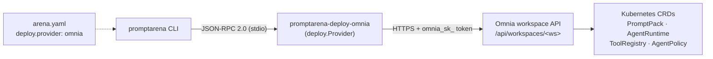

# promptarena-deploy-omnia

[](https://github.com/AltairaLabs/PromptArena-deploy-omnia/actions/workflows/ci.yml)
[](https://sonarcloud.io/summary/new_code?id=AltairaLabs_PromptArena-deploy-omnia)
[](https://sonarcloud.io/summary/new_code?id=AltairaLabs_PromptArena-deploy-omnia)
[](https://goreportcard.com/report/github.com/AltairaLabs/promptarena-deploy-omnia)
[](https://pkg.go.dev/github.com/AltairaLabs/promptarena-deploy-omnia)
[](https://opensource.org/licenses/MIT)

An [Omnia](https://github.com/AltairaLabs/Omnia) Kubernetes deploy adapter for [PromptKit](https://github.com/AltairaLabs/PromptKit). It translates a PromptKit pack into Omnia CRD resources (PromptPack, AgentRuntime, ToolRegistry, AgentPolicy) and manages their lifecycle through the Omnia workspace API. It runs as a JSON-RPC 2.0 subprocess that `promptarena` discovers and invokes automatically — `plan`, `apply`, `status`, `destroy`.

## Install

The adapter is distributed as a released binary; `promptarena` downloads and installs it for you:

```bash
promptarena deploy adapter install omnia
```

Pin a version, list installed adapters, or remove one:

```bash
promptarena deploy adapter install omnia@1.0.0
promptarena deploy adapter list
promptarena deploy adapter remove omnia
```

> If you run `promptarena deploy` without the adapter installed, the CLI prints the exact `install` command to run.

<details>
<summary>Build from source (development)</summary>

```bash
make build        # builds the adapter against a sibling ../promptkit checkout
```

The published binary is named `promptarena-deploy-omnia_<goos>_<goarch>` so `promptarena`'s installer can fetch it verbatim from a GitHub release.
</details>

## Configure

Add a `deploy` block to your `arena.yaml`. The adapter is selected by the `provider` value:

```yaml
deploy:
  provider: omnia
  config:
    api_endpoint: https://omnia.example.com
    workspace: my-workspace
    api_token: ${OMNIA_API_TOKEN}        # or export OMNIA_API_TOKEN
    providers:
      - { name: default,    ref: claude-prod,   role: llm }
      - { name: embeddings, ref: text-embed-3,  role: embedding }
    runtime:
      replicas: 2
      autoscaling:
        enabled: true
        type: hpa                        # hpa | keda (keda enables scale-to-zero)
        min_replicas: 2
        max_replicas: 10
    # tools:  []   # ToolRegistry handlers (http|grpc|mcp|openapi|client) — see the configuration reference
    # skills: []   # PromptPack skill bindings to workspace SkillSources — see the configuration reference
    labels:
      team: platform
```

`providers` also accepts the legacy `name → ref` map form (each entry becomes a `role: llm` binding). See the full schema in [`docs/`](docs/src/content/docs/reference/configuration.md).

## Deploy

```bash
promptarena deploy plan       # preview changes (no API calls in dry_run)
promptarena deploy apply      # create/update resources
promptarena deploy status     # report live resource health
promptarena deploy destroy    # tear down (reverse dependency order)
```

## Configuration Reference

| Field | Type | Required | Description |
|-------|------|----------|-------------|
| `api_endpoint` | `string` (URI) | Yes | Omnia workspace API base URL |
| `workspace` | `string` | Yes | Omnia workspace name (lowercase alphanumeric + hyphens) |
| `api_token` | `string` | No | `omnia_sk_` bearer token (or set `OMNIA_API_TOKEN`) |
| `providers` | list \| map | Yes | Role-aware bindings `[{name, ref, role}]` (roles: `llm`, `embedding`, `tts`, `stt`, `image`, `inference`); the legacy `name → ref` map is still accepted (→ `role: llm`) |
| `runtime.replicas` | `integer` | No | Replica count (default 1) |
| `runtime.cpu` / `runtime.memory` | `string` | No | Resource requests (K8s quantities) |
| `runtime.autoscaling` | object | No | HPA/KEDA passthrough (`enabled`, `type`, `min_replicas`, `max_replicas`, `target_cpu_utilization`, `target_memory_utilization`, `scale_down_stabilization_seconds`) |
| `tools` | list | No | Tool handlers emitted as the ToolRegistry `spec.handlers[]` (`http`/`grpc`/`mcp`/`openapi`/`client`) |
| `skills` | list | No | PromptPack skill bindings `[{source, include, mountAs}]`; each `source` must be a synced workspace `SkillSource` |
| `skillsConfig` | object | No | Skill activation strategy (`maxActive`, `selector`: `model-driven`/`tag`/`embedding`) |
| `labels` | `map[string]string` | No | Extra labels merged onto every created resource |
| `dry_run` | `boolean` | No | Simulate apply without API calls |

Full schema and per-field detail: [`docs/src/content/docs/reference/configuration.md`](docs/src/content/docs/reference/configuration.md).

## Resource Mapping

| Source | Omnia Resource | Notes |
|--------|----------------|-------|
| Pack JSON (content fold) | ConfigMap | Pack data, referenced by the PromptPack |
| Pack definition + `skills`/`skillsConfig` | PromptPack CRD | Inline pack tool schemas travel here via the content fold |
| `config.tools` | ToolRegistry CRD | `spec.handlers[]` — built from deploy config, **not** pack tools |
| Pack tool blocklist | AgentPolicy CRD | Only when a prompt defines a tool policy |
| Each agent + `providers` | AgentRuntime CRD | `spec.providers[]` (one `NamedProviderRef` per binding), `toolRegistryRef`, `runtime` sizing |

## Architecture

The adapter implements PromptKit's `deploy.Provider` interface and speaks JSON-RPC 2.0 over stdio. `promptarena` launches it as a subprocess and exchanges structured plan/apply/status/destroy requests; the adapter talks to the Omnia workspace API over HTTPS, which writes the CRDs.



### Apply phase order

Resources are created in strict dependency order so each can reference its prerequisites:

| Phase | Resource | Condition |
|-------|----------|-----------|
| 0 | ConfigMap (pack data) | Always |
| 1 | PromptPack | Always |
| 2 | ToolRegistry | Only if `config.tools` is non-empty |
| 3 | AgentPolicy | Only if a prompt defines a tool blocklist |
| 4 | AgentRuntime(s) | Always (one per agent) |

Destroy runs in reverse: AgentRuntime → AgentPolicy → ToolRegistry → PromptPack → ConfigMap.

### Kubernetes labels

Every resource carries managed labels for identification and lifecycle tracking:

| Label | Value |
|-------|-------|
| `app.kubernetes.io/managed-by` | `promptarena` |
| `promptkit.altairalabs.ai/pack-id` | Pack ID |
| `promptkit.altairalabs.ai/pack-version` | Pack version |
| `promptkit.altairalabs.ai/resource-type` | Resource type |

User-supplied `labels` are merged in, but managed labels always take precedence.

## Development

### Prerequisites

- Go 1.26+
- [golangci-lint](https://golangci-lint.run/usage/install/)
- [goimports](https://pkg.go.dev/golang.org/x/tools/cmd/goimports) (`go install golang.org/x/tools/cmd/goimports@latest`)
- A sibling [PromptKit](https://github.com/AltairaLabs/PromptKit) checkout at `../promptkit`

```bash
make build      # build the adapter binary
make test       # run tests with coverage
make lint       # golangci-lint
make check      # format + lint + test + build
```

## License

MIT — see [LICENSE](LICENSE).

## Links

- [PromptKit](https://github.com/AltairaLabs/PromptKit) · [Omnia](https://github.com/AltairaLabs/Omnia)
- [PromptKit deploy docs](https://promptkit.altairalabs.ai) (`arena/how-to/deploy`)
- Adapter docs: [`docs/`](docs/src/content/docs/)
